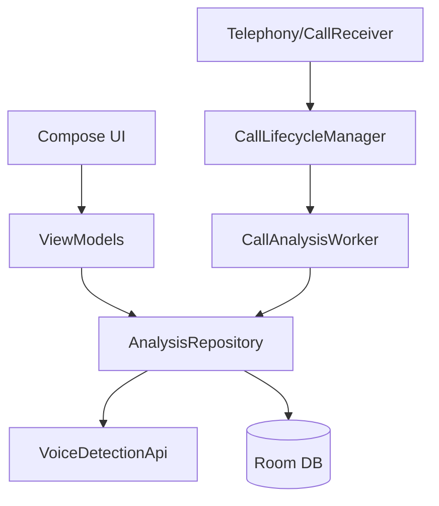

# Android Architecture

## Stack
- Kotlin, Jetpack Compose
- Room (`VoiceShieldDatabase`)
- WorkManager (`CallAnalysisWorker`)
- Retrofit + OkHttp + Moshi

## High-level diagram

## Call/session behavior
- Tracks call lifecycle states in local Room table.
- After call end, discovers recorded file and submits it for backend analysis.
- Not a true streaming chunk pipeline today.
