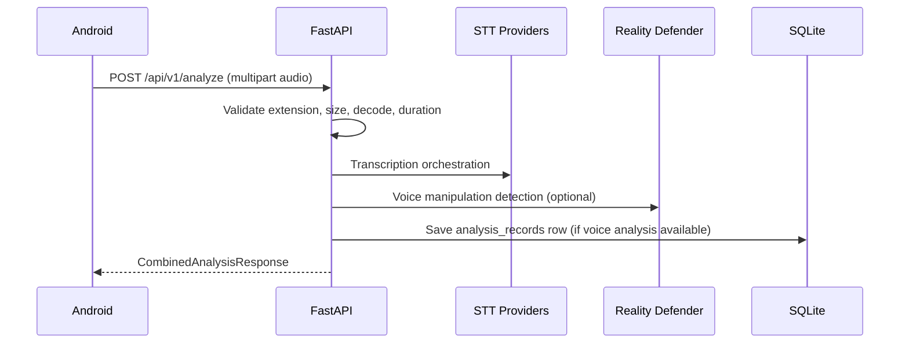

# Data Flow

## Current implemented flow

## Real-time chunk pipeline status
Chunk-based continuous call analysis with callback/webhook updates is **Planned**; current implementation is request/file based.
