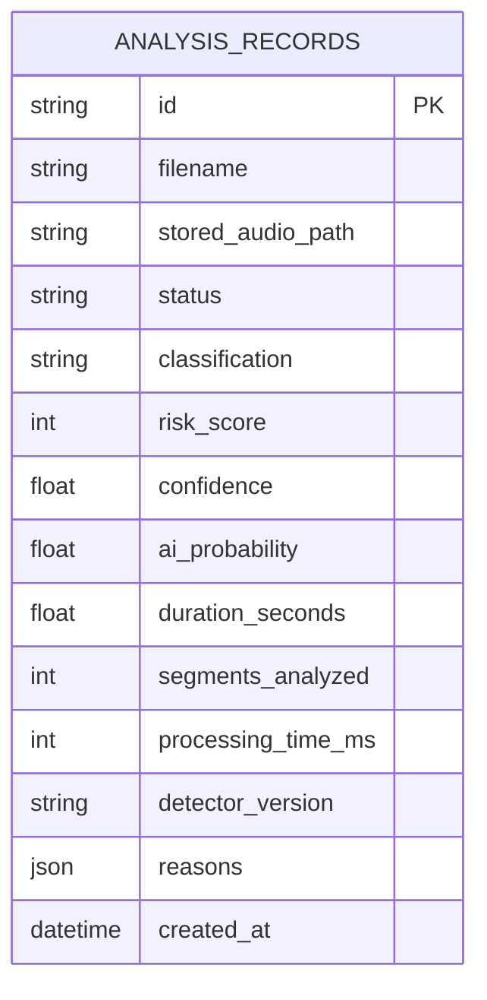
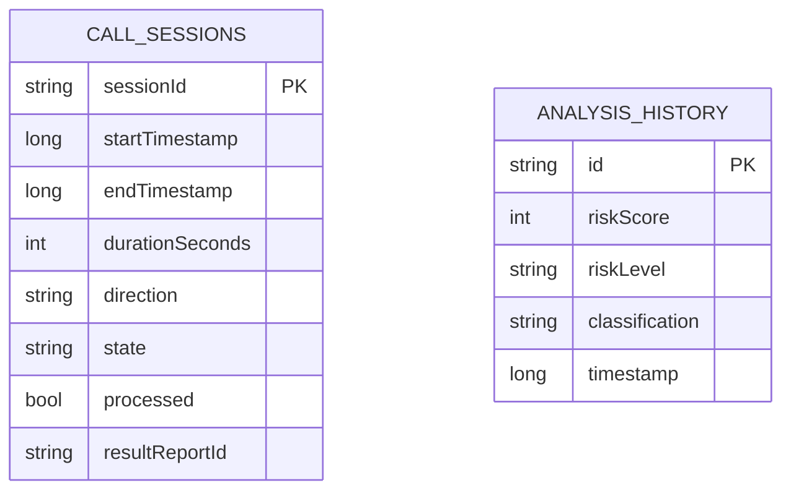

# Database Design

## Backend database (voice-shield-api)
Only one persisted table is currently defined in code:

## Android local database (voice-shield-app)

## Call/chunk/result model status
- `Call` and `Analysis` exist in Android local model.
- Backend chunk-level entities are **not yet implemented**.
