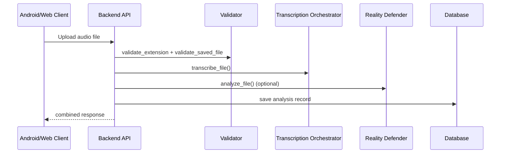
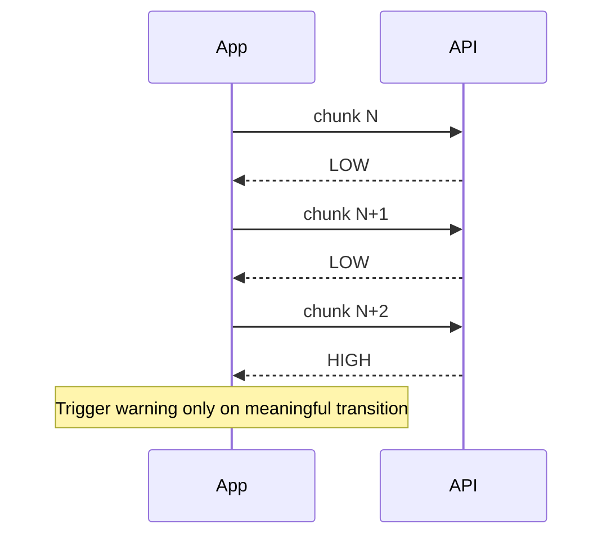
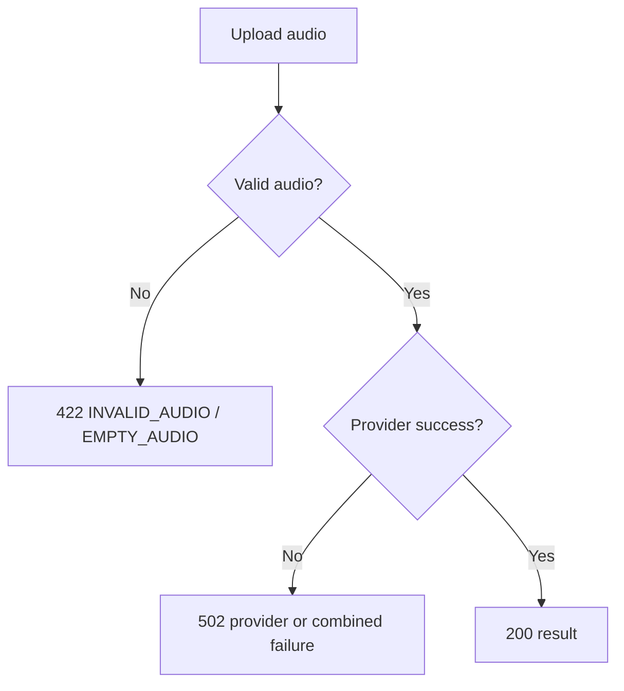

# Sequence Diagrams

## Normal processing

```mermaid
sequenceDiagram
    participant A as Android/Web Client
    participant B as Backend API
    participant V as Validator
    participant T as Transcription Orchestrator
    participant R as Reality Defender
    participant D as Database

    A->>B: Upload audio file
    B->>V: validate_extension + validate_saved_file
    B->>T: transcribe_file()
    B->>R: analyze_file() (optional)
    B->>D: save analysis record
    B-->>A: combined response
```

## Planned risk escalation model

```mermaid
sequenceDiagram
    participant App
    participant API
    App->>API: chunk N
    API-->>App: LOW
    App->>API: chunk N+1
    API-->>App: LOW
    App->>API: chunk N+2
    API-->>App: HIGH
    Note over App: Trigger warning only on meaningful transition
```

## Error flow

```mermaid
flowchart TD
    U[Upload audio] --> V{Valid audio?}
    V -- No --> E422[422 INVALID_AUDIO / EMPTY_AUDIO]
    V -- Yes --> P{Provider success?}
    P -- No --> E502[502 provider or combined failure]
    P -- Yes --> OK[200 result]
```
