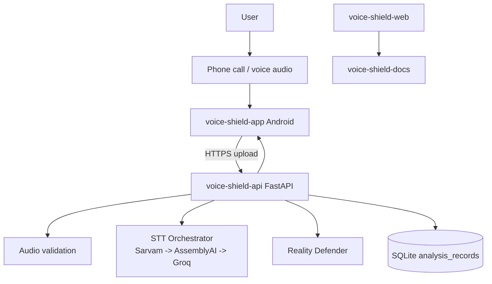
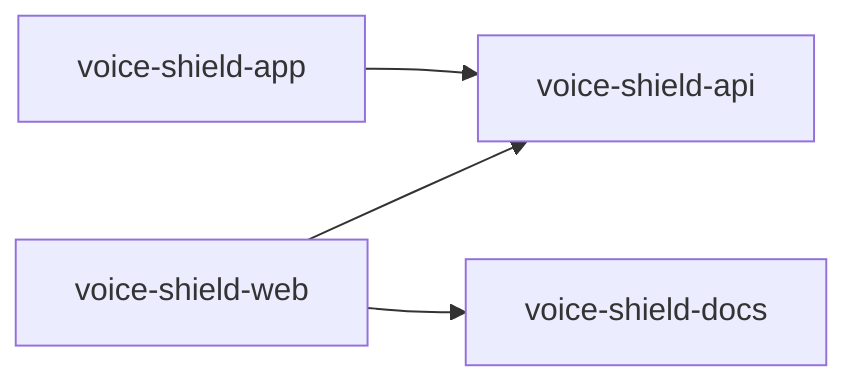
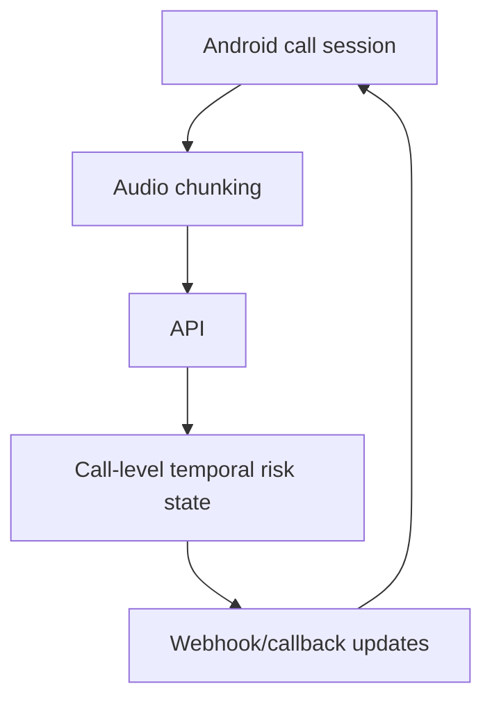

# System Architecture

## High-level architecture (current + target)

```mermaid
flowchart TD
    U[User] --> C[Phone call / voice audio]
    C --> A[voice-shield-app Android]
    A -->|HTTPS upload| API[voice-shield-api FastAPI]
    API --> V[Audio validation]
    API --> STT[STT Orchestrator
Sarvam -> AssemblyAI -> Groq]
    API --> RD[Reality Defender]
    API --> DB[(SQLite analysis_records)]
    API --> A
    WEB[voice-shield-web] --> DOCS[voice-shield-docs]
```

## Repository relationship

```mermaid
flowchart LR
    APP[voice-shield-app] --> API[voice-shield-api]
    WEB[voice-shield-web] --> API
    WEB --> DOCS[voice-shield-docs]
```

## Planned architecture (explicitly not yet fully implemented)

```mermaid
flowchart TD
    APP[Android call session] --> CH[Audio chunking]
    CH --> API
    API --> RISK[Call-level temporal risk state]
    RISK --> WH[Webhook/callback updates]
    WH --> APP
```
