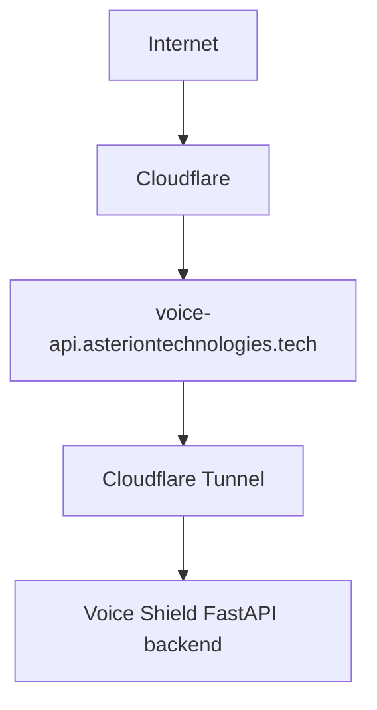

# Cloudflare and Domain Routing

Known public API domain used by app defaults:
- `voice-api.asteriontechnologies.tech`

Target architecture (documented intent):

Status: tunnel-level config files were not found in inspected repositories; treat operational details as pending verification.
